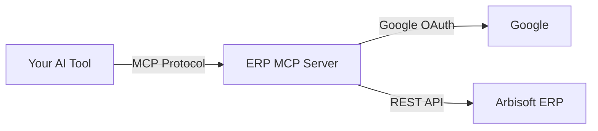
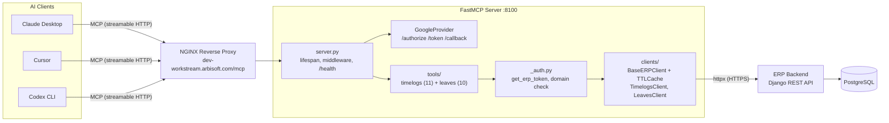

# ERP MCP Server

MCP (Model Context Protocol) server for Arbisoft's ERP system. Lets AI assistants manage time logs and leaves through natural language -- 21 tools across 2 domains. Built on FastMCP v3 with Google OAuth. Internal tool for `@arbisoft.com` users.

## How It Works

You connect this MCP server to your AI tool (Claude Desktop, Cursor, Claude Code, Codex, or Gemini CLI). On first use, you authenticate with your Google Workspace account through a one-time OAuth consent flow. After that, you ask natural-language questions and the AI calls MCP tools that talk to the ERP API on your behalf.



## Quick Start -- Connect Your AI Tool

### Prerequisites

- `@arbisoft.com` Google Workspace account
- Active access to Arbisoft ERP (https://erp.arbisoft.com)

### Claude Code

```bash
claude mcp add --transport http erp-mcp https://dev-workstream.arbisoft.com/mcp
```

### Claude Desktop

Add to MCP settings (Settings > Developer > MCP Servers):

```json
{
  "mcpServers": {
    "erp-mcp": {
      "url": "https://dev-workstream.arbisoft.com/mcp"
    }
  }
}
```

### Cursor

Add to MCP settings (Settings > MCP):

```json
{
  "mcpServers": {
    "erp-mcp": {
      "url": "https://dev-workstream.arbisoft.com/mcp"
    }
  }
}
```

### Codex CLI

```bash
codex mcp add --transport http erp-mcp https://dev-workstream.arbisoft.com/mcp
```

### Gemini CLI

```bash
gemini mcp add --transport http erp-mcp https://dev-workstream.arbisoft.com/mcp
```

### First Use

On your first tool call, you will be prompted to sign in with your Google account. This is a one-time OAuth consent flow.

## Example Prompts

### Daily Time Logging

- "Log 3 hours on Workstream today: Sprint planning and backlog grooming"
- "What did I log yesterday?"
- "Update today's Workstream entry to 2 hours and add 3 hours on Hirestream for API development"
- "Delete the Hirestream log entry from Monday"

### Weekly Review

- "Show me this week's time logs"
- "Fill my logs for this week on Workstream -- 3 hours standup and code review, 3 hours API development, 2 hours testing, skip weekends"
- "Mark this week as complete"

### Monthly Views

- "Show all my logs for January 2026"
- "What projects did I log time on last month?"

### Leave Management

- "How many leaves do I have left this fiscal year?"
- "Apply for casual leave from March 10 to March 12 -- family commitment"
- "Who on my team is on leave today?"
- "Show my leave history for this month"
- "Cancel my pending leave request"

### Bulk Operations

- "Fill 3 hours daily on Hirestream for the last 2 weeks -- deployment automation, skip weekends"
- "Show me all logs from Jan 1 to Jan 31"

### Diagnostics

- "What projects can I log time against?"
- "Check if a week log exists for today on the Workstream project"
- "What leave types are available?"

## Available Tools

### Timelogs (11 tools)

| Tool | Description | Type |
|------|-------------|------|
| `timelogs_list_projects` | List your active projects and subteams | Read |
| `timelogs_list_labels` | Get available log labels for categorizing entries | Read |
| `timelogs_get_week` | Get project logs for a specific week | Read |
| `timelogs_get_day` | Get detailed logs for a specific day | Read |
| `timelogs_get_range` | Get logs across a date range (max 366 days) | Read |
| `timelogs_get_month` | Get all logs for a month | Read |
| `timelogs_upsert_entry` | Add or update a time log entry | Write |
| `timelogs_delete_entry` | Remove a time log entry | Write |
| `timelogs_complete_week` | Mark a week as completed (or save draft) | Write |
| `timelogs_fill_days` | Bulk-fill logs for a date range (max 31 days) | Write |
| `timelogs_check_week_project` | Check if PersonWeekProject exists for a date/project | Diagnostic |

### Leaves (10 tools)

| Tool | Description | Type |
|------|-------------|------|
| `leaves_get_choices` | Get available leave types and approver info | Read |
| `leaves_get_fiscal_years` | Get fiscal years for leave queries | Read |
| `leaves_get_summary` | Get leave balances (used, available, encashed) | Read |
| `leaves_list_month` | Get approved leaves and holidays for a month | Read |
| `leaves_list_mine` | List your leave requests (all statuses) | Read |
| `leaves_list_team` | See who on your team is on leave | Read |
| `leaves_list_encashments` | List your leave encashment claims | Read |
| `leaves_apply` | Apply for leave | Write |
| `leaves_cancel` | Cancel a pending leave request | Write |
| `leaves_create_encashment` | Request leave encashment (monetization) | Write |

See [Tool Reference](docs/tool-reference.md) for full parameter details and constraints.

## Troubleshooting

### "Client Not Registered" error after server restart

FastMCP stores Dynamic Client Registrations in-memory. Server restarts wipe them, but `mcp-remote` caches stale client IDs locally.

**Fix:** Delete the cached client info:

```bash
rm ~/.mcp-auth/mcp-remote-*/0cb0ce51425c66714b05cb33c689fdd0_*
```

### OAuth consent keeps looping / token expired

Google OAuth tokens expire. Some AI tools handle refresh automatically, others require re-authentication.

**Fix:** Disconnect and reconnect the MCP server in your AI tool settings, then retry.

### "ERP request failed with status 403"

Your Google account does not have access to the ERP system, or the domain check failed.

**Fix:** Verify you can log in to https://erp.arbisoft.com with the same Google account. Must be `@arbisoft.com`.

### "PersonWeekProject not found" / can't add logs

The ERP requires a PersonWeekProject record to exist before time logs can be added for a project+week combination. This record is created by the ERP web app when you first access a project's week view -- not by the MCP.

**Fix:** Open the ERP web app, navigate to the project's week view for the relevant week, then retry via MCP.

### "Provide either project_id or project_name"

Write tools require you to specify which project -- either by ID or name.

**Fix:** Ask "What projects can I log time against?" first, then use the project name or ID in your request.

---

## Architecture

Layered architecture with domain separation. FastMCP v3 handles the MCP protocol and OAuth. Tool modules register via `@mcp.tool` inside a `register(mcp)` function. Domain clients compose over a shared `BaseERPClient` for HTTP transport, token exchange, and response caching.



See [Architecture Guide](docs/architecture.md) for auth flow, request lifecycle, and code structure diagrams.

## Development

### Setup

```bash
python3 -m venv ~/.virtualenvs/erp-mcp
source ~/.virtualenvs/erp-mcp/bin/activate
pip install -r requirements.txt
pip install -r requirements-dev.txt
```

### Run Locally

```bash
export GOOGLE_CLIENT_ID="your-google-client-id"
export GOOGLE_CLIENT_SECRET="your-google-client-secret"
export ERP_API_BASE_URL="http://127.0.0.1:8000/api/v1"
export MCP_BASE_URL="http://localhost:8100"
python server.py
```

### Testing

```bash
pytest tests/ -v                                    # all tests
pytest tests/test_tools_timelogs.py -v              # single file
pytest tests/test_clients_base.py::TestTTLCache -v  # single class
```

Tests do not require OAuth credentials -- `conftest.py` sets test env vars automatically.

### Linting

```bash
ruff check .                                              # lint
ruff format .                                             # auto-format
mypy server.py _auth.py _constants.py tools/ clients/     # type check (strict)
```

### Docker

```bash
docker build -t erp-mcp .
docker run -p 8100:8100 --env-file .env erp-mcp
```

## Project Structure

```
erp-mcp/
├── server.py                    # FastMCP instance, GoogleProvider, middleware, /health
├── _auth.py                     # Auth: get_erp_token(), tool_error_handler(), domain check
├── _constants.py                # Shared constants (MAX_FILL_DAYS, MAX_LEAVE_DAYS, etc.)
├── clients/
│   ├── __init__.py              # ERPClientRegistry, get_registry(), set_registry()
│   ├── _base.py                 # BaseERPClient + TTLCache (HTTP transport, token exchange)
│   ├── timelogs.py              # TimelogsClient (composition over BaseERPClient)
│   └── leaves.py                # LeavesClient (composition over BaseERPClient)
├── tools/
│   ├── __init__.py              # Domain loader (AVAILABLE_DOMAINS, load_domains())
│   ├── timelogs.py              # 11 timelog tools (register(mcp) pattern)
│   └── leaves.py                # 10 leaves tools (register(mcp) pattern)
├── tests/
│   ├── conftest.py              # Shared fixtures, env var setup
│   ├── test_security.py         # AST-based security enforcement (auto-discovers all tools)
│   ├── test_feature_flags.py    # Domain loader tests
│   ├── test_clients_base.py     # BaseERPClient + TTLCache tests
│   ├── test_clients_timelogs.py # TimelogsClient HTTP tests
│   ├── test_clients_leaves.py   # LeavesClient HTTP tests
│   ├── test_tools_timelogs.py   # Timelog tool tests
│   └── test_tools_leaves.py     # Leaves tool tests
├── docs/
│   ├── architecture.md          # Architecture guide with Mermaid diagrams
│   └── tool-reference.md        # Full tool parameter reference
├── Dockerfile                   # Multi-stage build, non-root, Python 3.12
├── .github/workflows/
│   └── build-and-push.yml       # CI: lint + test + Docker build + ECR push
├── pyproject.toml               # Project config (ruff, mypy, pytest settings)
├── requirements.txt             # Production deps (loose pins)
├── requirements.lock            # Production deps (exact pins for CI/Docker)
├── requirements-dev.txt         # Dev deps (loose pins)
├── requirements-dev.lock        # Dev deps (exact pins for CI)
└── CONTRIBUTING.md              # Guide for adding new tools and domains
```

## Environment Variables

| Variable | Purpose | Default | Required |
|----------|---------|---------|----------|
| `GOOGLE_CLIENT_ID` | Google OAuth client ID | -- | Yes |
| `GOOGLE_CLIENT_SECRET` | Google OAuth client secret | -- | Yes |
| `ERP_API_BASE_URL` | ERP API root URL | `https://erp.arbisoft.com/api/v1/` | No |
| `MCP_BASE_URL` | Public URL for OAuth callbacks | `https://erp.arbisoft.com` | No |
| `MCP_PORT` | Server listen port | `8100` | No |
| `MCP_HOST` | Server bind address | `127.0.0.1` | No |
| `ALLOWED_DOMAIN` | Google Workspace domain restriction | `arbisoft.com` | No |
| `LOG_LEVEL` | Python logging level | `INFO` | No |

## CI/CD

GitHub Actions (`.github/workflows/build-and-push.yml`):

- **On push to `main` / PRs:** Lint (`ruff check`), type check (`mypy`), tests (`pytest`)
- **On push to `main` / PRs:** Docker build verification (build + smoke test, no push)
- **On version tags (`v*`):** Build Docker image, Trivy vulnerability scan, push to ECR
- **On `workflow_dispatch`:** Build dev image from any branch, tagged `dev-{sha}` + `dev-latest`

## Contributing

See [CONTRIBUTING.md](CONTRIBUTING.md) for the complete guide on adding new tools and domains, including test patterns and the security compliance checklist.
