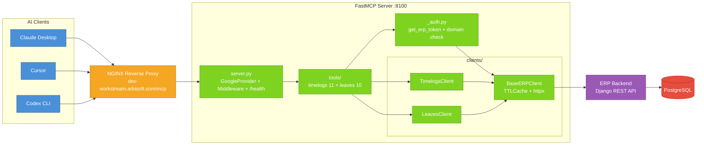
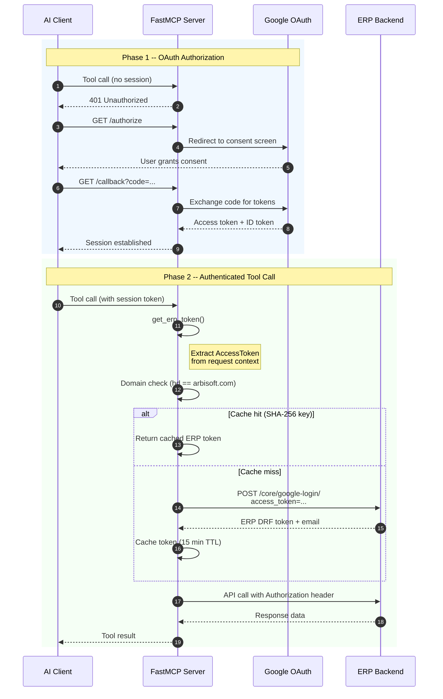
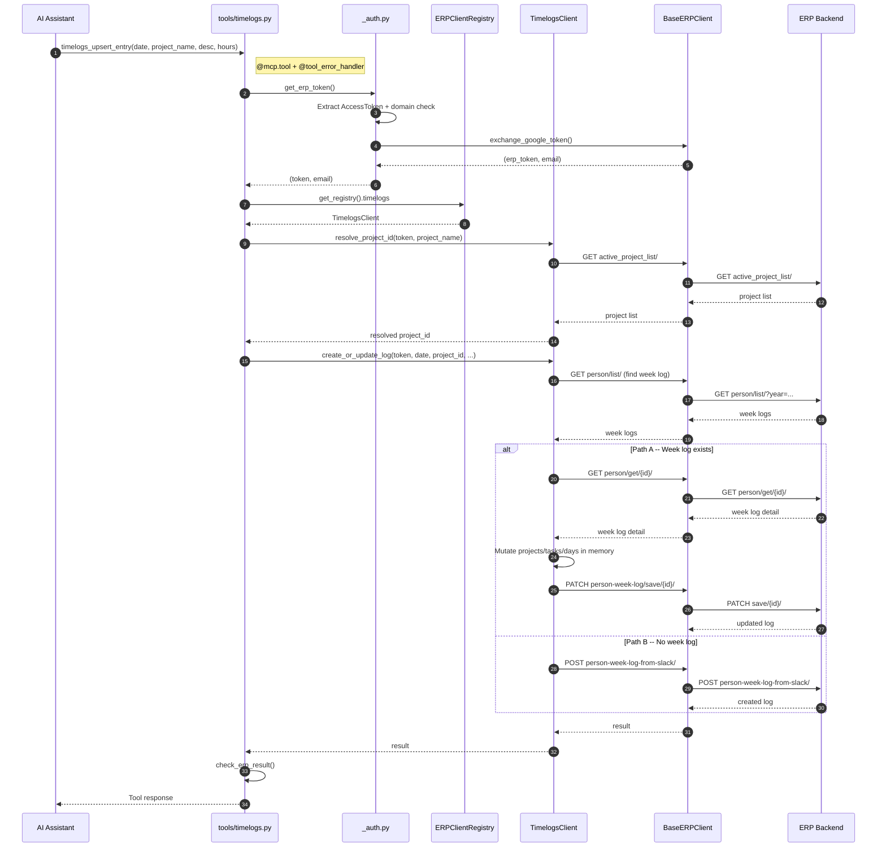
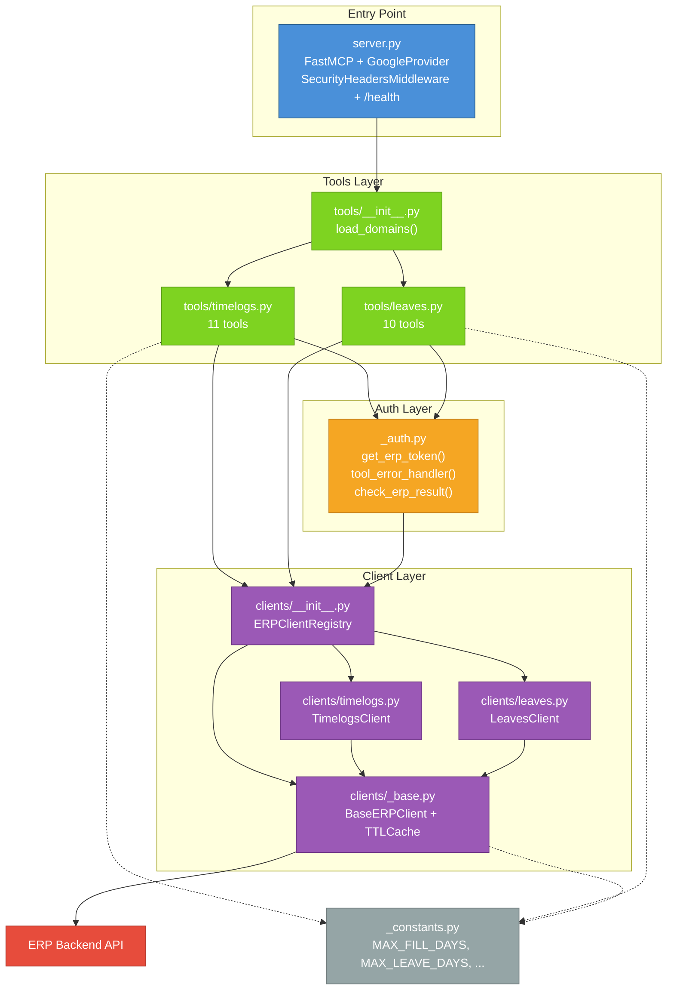

# ERP MCP Server -- Architecture

## System Overview

The ERP MCP Server follows a layered design: AI clients (Claude Desktop, Cursor, Codex CLI, Gemini CLI) connect over the Model Context Protocol to a FastMCP server running behind NGINX. Each tool call flows through an authentication layer that exchanges Google OAuth tokens for ERP session tokens, then delegates to domain-specific clients that call the ERP backend's Django REST API. This separation keeps transport, auth, business logic, and HTTP concerns in distinct modules.

## System Architecture



## Authentication Flow



## Tool Request Lifecycle

This sequence shows `timelogs_upsert_entry` as a representative write-path example.



## Code Structure



**Legend:** Solid edges represent runtime calls. Dotted edges represent constants imports.

## Security Controls

| ID | Control | Implementation |
|----|---------|----------------|
| SEC-01 | No email parameter on tools | Identity derived from Google token claims only (`_auth.py`) |
| SEC-02 | Domain restriction | `hd` claim + email suffix check in `get_erp_token()` |
| SEC-03 | Hashed cache keys | SHA-256 of Google token in `BaseERPClient.exchange_google_token()` |
| SEC-04 | No stack traces in responses | `tool_error_handler()` logs server-side, returns generic `ToolError` |
| SEC-05 | Write guardrails | 31-day cap (timelogs), 90-day cap (leaves), audit logging on all writes |
| SEC-06 | No HTTP redirects | `follow_redirects=False` in httpx client |
| SEC-07 | HTTPS enforcement | `BaseERPClient.__init__` rejects non-HTTPS for non-localhost |

Tests enforce these controls via AST-based auto-discovery in `test_security.py`. Adding a new `@mcp.tool` in any `tools/*.py` file automatically includes it in security checks without manual test registration.

## ERP API Endpoints

| Endpoint | Method | Used By |
|----------|--------|---------|
| `project-logs/person/list/` | GET | `timelogs_get_week`, `timelogs_get_day` |
| `project-logs/person/get/{id}/` | GET | `timelogs_get_week`, `timelogs_upsert_entry`, `timelogs_delete_entry` |
| `project-logs/person/month-list/` | GET | `timelogs_get_month`, `timelogs_get_range` |
| `project-logs/person/active_project_list/` | GET | `timelogs_list_projects`, `timelogs_upsert_entry`, `timelogs_delete_entry` |
| `project-logs/person/person-week-log/save/{id}/` | PATCH | `timelogs_upsert_entry`, `timelogs_delete_entry` |
| `project-logs/person/person-week-log/complete/{id}/` | PATCH | `timelogs_complete_week` |
| `project-logs/person/person-week-log-from-slack/` | POST | `timelogs_upsert_entry` (fallback) |
| `project-logs/log_labels/` | GET | `timelogs_list_labels` |
| `core/google-login/` | POST | Token exchange (all tools) |
| `leaves/choices/get/` | GET | `leaves_get_choices` |
| `leaves/individual_leave_fiscal_years/` | GET | `leaves_get_fiscal_years` |
| `leaves/leave_summary/get/` | GET | `leaves_get_summary` |
| `leaves/person/month_leaves/` | GET | `leaves_list_month` |
| `leaves/holiday_records/` | GET | `leaves_list_month` |
| `leaves/list/` | GET | `leaves_list_mine` |
| `leaves/team_leaves/list/` | GET | `leaves_list_team` |
| `leaves/person-leave-encashments/` | GET/POST | `leaves_list_encashments`, `leaves_create_encashment` |
| `leaves/request/apply/` | POST | `leaves_apply` |
| `leaves/delete_leave/{id}/` | POST | `leaves_cancel` |

## Backend Model Chain

```
Person -> PersonTeam -> PersonWeekLog -> PersonWeekProject -> ProjectTask -> ProjectTaskDayDetail
```

`PersonWeekProject` must exist before time log entries can be added to a week. This record links a `PersonWeekLog` (the week container) to a `PersonTeam` (linking the person to a specific subteam/project). The ERP web application creates `PersonWeekProject` records through its normal team-assignment workflows -- the MCP server cannot create them.

The `timelogs_check_week_project` diagnostic tool verifies this prerequisite. When a user reports that log creation fails for a specific project and week, this tool confirms whether the underlying `PersonWeekProject` exists or needs to be created through the ERP web interface first.
